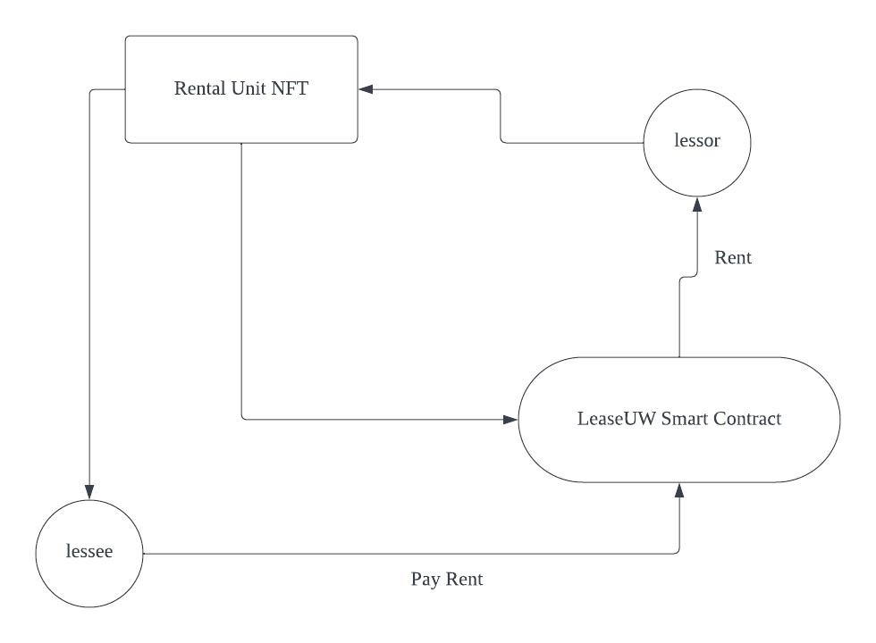

# LeaseUW DApp

## Motivation

The students at University of Waterloo need to lease condo every term. 

But there are two bad scenarios:

- The lessor(landlord) does not own the rental unit(condo) or they sign multiple lease contracts with different people for one rental unit, and escape :(
- The lessee does not pay the rent

## How the smart contract solves the problem

Every condo is a NFT (ERC721).

Lessor transfer the NFT to the smart contract LeaseUW which prohibits that they don't own the property or they give the NFT to multiple lessee.

Lessee transfer the deposit and rent to smart contract and lessor can get the funds when deal is done. 

We set an inspector to inspect if the lease is legal. For example, if the rental unit is undamaged.

This is just a simple model and we can improve it in many ways, for example:

- Set a time period within which the lessee can get the refund, or the funds will go to lessor.
- Lock the nft(condo) when a lease agreement is in progress.
- Add more inspectors for one lessor.
- I didn't add the frontend UI but it should be an easy thing in real scenarios.
- More and more...

## If you want to check the code

The smart contracts for NFT and LeaseUW are in contracts folder.

The test codes for the whole process are in test folder.

The fake data comes from Dapp University.

## Technology Stack & Tools

- Solidity
- Javascript
- [Hardhat](https://hardhat.org/) (Development Framework)
- [Ethers.js](https://docs.ethers.io/v5/) (Blockchain Interaction)

## Requirements For Initial Setup
- Install [NodeJS](https://nodejs.org/en/)

## Setting Up
### 1. Clone/Download the Repository

### 2. Install Dependencies:
`$ npm install`

### 3. Run tests
`$ npx hardhat test`

### 4. Start Hardhat node
`$ npx hardhat node`

### 5. Run deployment script (not implemented)
In a separate terminal execute:
`$ npx hardhat run ./scripts/deploy.js --network localhost`